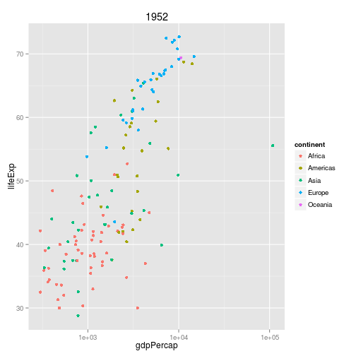

> ### Learning Objectives {.objectives}
>
> * Why write functions
> * How to define a function
> * Defining graphing functions
> * Scope and global variables

### Why?

There are two main reasons to write R functions.

- Avoid repeated code
- More readable code

As an example, consider this code to convert 65 degrees Fahrenheit to
Celsius.

~~~{.r}
cel <- (65 - 32)*5/9
~~~

If you then want to convert 100 degrees F, you'll have to retype all
of that. And the code itself doesn't really explain it's purpose.

~~~{.r}
f2c <-
    function(fahrenheit)
{
    celsius <- (fahrenheit - 32)*5/9
    return(celsius)
}
~~~

The definition of a function has three parts:

- `function()`, containing any _arguments_ (in other words, parameters or inputs) that the
  function takes
- The body of the function (the bit that is executed when the function
  is called
- The assignment of the function to an object; in this case we've
  called it `f2c`.

This function definition could actually be simplified. In R functions,
an explicit `return` statement is not needed; the function will
_return_ the value of the last statement, so we could write:

~~~{.r}
f2c <-
    function(fahrenheit)
{
    (fahrenheit - 32)*5/9
}
~~~

And, actually, the curly braces aren't needed when the function has
just one statement. We could have written:

~~~{.r}
f2c <-
    function(fahrenheit)
    (fahrenheit - 32)*5/9
~~~

> ### Challenge {.challenge}
>
> Write the opposite function, for converting from celsius to
> Fahrenheit. Test that it works.

### Functions for plotting

Functions are particularly useful when making graphs. You'll often
want to make the same sort of graph multiple times, for example, a
scatterplot of `lifeExp` vs `gdpPercap` for each of several different
years. Rather than repeat the code multiple times, write a function
that does the work and then call it several times.

Let's reload the `gapminder` data, as before.

~~~{.r}
gapminder <- read.csv("~/Desktop/gapminder.csv")
~~~

Here's a function to make a plot for a particular year.

~~~{.r}
plot_year <-
    function(year=2007, data=gapminder)
{
    library(dplyr)
    library(ggplot2)

    the_year <- year
    gm_year <- filter(data, year==the_year)

    ggplot(gm_year, aes(y=lifeExp, x=gdpPercap)) +
        geom_point() + scale_x_log10()
}
~~~

The function returns the ggplot object. You could add further
enhancements after the fact.

~~~{.r}
plot_year(1952) + aes(color=continent) + ggtitle(1952)
~~~

~~~{.output}

Attaching package: 'dplyr'

The following object is masked from 'package:stats':

    filter

The following objects are masked from 'package:base':

    intersect, setdiff, setequal, union

Loading required package: methods

~~~

Note that I passed the data as an argument and gave each argument a
default value.

> ### Challenge {.challenge}
>
> Write a function that makes a plot of `lifeExp` vs `gdpPercap` across
> years, for a selected country.

~~~{.r}
plot_country <-
    function(country="China", data=gapminder)
{
    library(dplyr)
    library(ggplot2)

    the_country <- country
    gm_country <- filter(data, country==the_country)

    p <- ggplot(gm_country, aes(y=lifeExp, x=gdpPercap)) +
        geom_point()

    p
}
~~~

### Scope

- variables defined within a function are destroyed on exit.
- if function refers to a variable that hasn't been defined locally,
  look outside to global environment.
- things are more tricky for functions defined within functions, but
  maybe we'll skip that.

### Conditional statements

~~~{.r}
plot_country <-
    function(country="China", data=gapminder, add_curve=FALSE)
{
    library(dplyr)
    library(ggplot2)

    the_country <- country
    gm_country <- filter(data, country==the_country)

    p <- ggplot(gm_country, aes(y=lifeExp, x=gdpPercap)) +
        geom_point()

    if(add_curve)
        p <- p + geom_smooth(method="loess")
    p
}
~~~

Maybe also include `include_se`?

### Multiple-choice arguments

Allow `method` to be either `"loess"` or `"lm"`.

### The `...` argument

Perhaps pass `...` to `geom_smooth`, to cover each of `method` and `se`.
